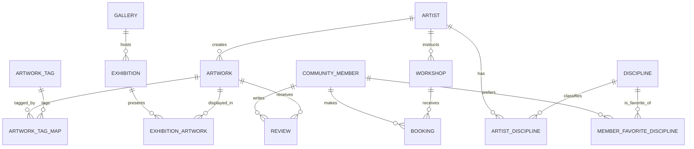

# Etape 2 - Modelisation conceptuelle et logique

## 1. Perimetre retenu

Cette proposition de base de donnees couvre les objets visibles dans l'application ArtConnect:

- artistes
- oeuvres
- disciplines artistiques
- tags d'oeuvres
- galeries
- expositions
- ateliers
- membres de la communaute
- reservations d'ateliers
- avis sur les oeuvres

Les classes Java du projet ne contiennent pas d'identifiants techniques. Pour la base relationnelle, on ajoute donc des cles primaires artificielles de type entier auto-incremente.

## 2. Choix d'identifiants

- `artist.artist_id`
- `artwork.artwork_id`
- `discipline.discipline_id`
- `artwork_tag.tag_id`
- `gallery.gallery_id`
- `exhibition.exhibition_id`
- `workshop.workshop_id`
- `community_member.member_id`
- `booking.booking_id`
- `review.review_id`

Les tables d'association utilisent une cle primaire composite:

- `artist_discipline (artist_id, discipline_id)`
- `member_favorite_discipline (member_id, discipline_id)`
- `artwork_tag_map (artwork_id, tag_id)`
- `exhibition_artwork (exhibition_id, artwork_id)`

## 3. MCD

### Entites et attributs

#### ARTIST
- artist_id
- name
- bio
- birth_year
- contact_email
- phone
- city
- website
- social_media
- is_active

#### DISCIPLINE
- discipline_id
- name

#### ARTWORK
- artwork_id
- title
- creation_year
- type
- medium
- dimensions
- description
- price
- status
- artist_id

#### ARTWORK_TAG
- tag_id
- name

#### GALLERY
- gallery_id
- name
- address
- owner_name
- opening_hours
- contact_phone
- rating
- website

#### EXHIBITION
- exhibition_id
- title
- start_date
- end_date
- description
- curator_name
- theme
- gallery_id

#### WORKSHOP
- workshop_id
- title
- workshop_datetime
- duration_minutes
- max_participants
- price
- location
- description
- level
- instructor_artist_id

#### COMMUNITY_MEMBER
- member_id
- name
- email
- birth_year
- phone
- city
- membership_type

#### BOOKING
- booking_id
- workshop_id
- member_id
- booking_date
- payment_status

#### REVIEW
- review_id
- member_id
- artwork_id
- rating
- comment
- review_date

### Relations et cardinalites

- Un artiste cree 0..N oeuvres; une oeuvre est creee par 1 seul artiste.
- Un artiste pratique 0..N disciplines; une discipline peut etre pratiquee par 0..N artistes.
- Une oeuvre possede 0..N tags; un tag peut caracteriser 0..N oeuvres.
- Une galerie organise 0..N expositions; une exposition se tient dans 1 seule galerie.
- Une exposition presente 0..N oeuvres; une oeuvre peut apparaitre dans 0..N expositions.
- Un artiste anime 0..N ateliers; un atelier a 1 seul artiste instructeur.
- Un membre reserve 0..N ateliers; un atelier peut avoir 0..N reservations.
- Un membre suit 0..N disciplines favorites; une discipline peut etre favorite de 0..N membres.
- Un membre redige 0..N avis; une oeuvre recoit 0..N avis.

### ERD textuel

## 4. MLD

### Tables principales

#### `artist`
- `artist_id` INT PK
- `name` VARCHAR(150) NOT NULL
- `bio` TEXT NULL
- `birth_year` SMALLINT NULL
- `contact_email` VARCHAR(255) NOT NULL UNIQUE
- `phone` VARCHAR(30) NULL
- `city` VARCHAR(120) NULL
- `website` VARCHAR(255) NULL
- `social_media` VARCHAR(255) NULL
- `is_active` BOOLEAN NOT NULL

#### `discipline`
- `discipline_id` INT PK
- `name` VARCHAR(100) NOT NULL UNIQUE

#### `artist_discipline`
- `artist_id` INT PK FK -> `artist.artist_id`
- `discipline_id` INT PK FK -> `discipline.discipline_id`

#### `artwork`
- `artwork_id` INT PK
- `artist_id` INT NOT NULL FK -> `artist.artist_id`
- `title` VARCHAR(180) NOT NULL
- `creation_year` SMALLINT NULL
- `type` VARCHAR(80) NOT NULL
- `medium` VARCHAR(120) NULL
- `dimensions` VARCHAR(100) NULL
- `description` TEXT NULL
- `price` DECIMAL(10,2) NOT NULL
- `status` VARCHAR(20) NOT NULL

#### `artwork_tag`
- `tag_id` INT PK
- `name` VARCHAR(80) NOT NULL UNIQUE

#### `artwork_tag_map`
- `artwork_id` INT PK FK -> `artwork.artwork_id`
- `tag_id` INT PK FK -> `artwork_tag.tag_id`

#### `gallery`
- `gallery_id` INT PK
- `name` VARCHAR(150) NOT NULL
- `address` VARCHAR(255) NOT NULL
- `owner_name` VARCHAR(150) NULL
- `opening_hours` VARCHAR(120) NULL
- `contact_phone` VARCHAR(30) NULL
- `rating` DECIMAL(3,2) NULL
- `website` VARCHAR(255) NULL

#### `exhibition`
- `exhibition_id` INT PK
- `gallery_id` INT NOT NULL FK -> `gallery.gallery_id`
- `title` VARCHAR(180) NOT NULL
- `start_date` DATE NOT NULL
- `end_date` DATE NOT NULL
- `description` TEXT NULL
- `curator_name` VARCHAR(150) NULL
- `theme` VARCHAR(120) NULL

#### `exhibition_artwork`
- `exhibition_id` INT PK FK -> `exhibition.exhibition_id`
- `artwork_id` INT PK FK -> `artwork.artwork_id`

#### `workshop`
- `workshop_id` INT PK
- `instructor_artist_id` INT NOT NULL FK -> `artist.artist_id`
- `title` VARCHAR(180) NOT NULL
- `workshop_datetime` DATETIME NOT NULL
- `duration_minutes` INT NOT NULL
- `max_participants` INT NOT NULL
- `price` DECIMAL(10,2) NOT NULL
- `location` VARCHAR(255) NULL
- `description` TEXT NULL
- `level` VARCHAR(30) NULL

#### `community_member`
- `member_id` INT PK
- `name` VARCHAR(150) NOT NULL
- `email` VARCHAR(255) NOT NULL UNIQUE
- `birth_year` SMALLINT NULL
- `phone` VARCHAR(30) NULL
- `city` VARCHAR(120) NULL
- `membership_type` VARCHAR(30) NOT NULL

#### `member_favorite_discipline`
- `member_id` INT PK FK -> `community_member.member_id`
- `discipline_id` INT PK FK -> `discipline.discipline_id`

#### `booking`
- `booking_id` INT PK
- `workshop_id` INT NOT NULL FK -> `workshop.workshop_id`
- `member_id` INT NOT NULL FK -> `community_member.member_id`
- `booking_date` DATETIME NOT NULL
- `payment_status` VARCHAR(20) NOT NULL

Contrainte supplementaire:
- `UNIQUE(workshop_id, member_id)` pour eviter un double enregistrement au meme atelier.

#### `review`
- `review_id` INT PK
- `member_id` INT NOT NULL FK -> `community_member.member_id`
- `artwork_id` INT NOT NULL FK -> `artwork.artwork_id`
- `rating` INT NOT NULL
- `comment` TEXT NULL
- `review_date` DATE NOT NULL

Contrainte supplementaire:
- `UNIQUE(member_id, artwork_id)` pour limiter un membre a un avis par oeuvre.

## 5. Justification de la normalisation

### 1FN

La base respecte la 1FN car:

- chaque attribut est atomique
- il n'y a pas de liste stockee dans une seule colonne
- les relations multiples sont sorties dans des tables d'association

Exemples:

- les disciplines d'un artiste vont dans `artist_discipline`
- les tags d'une oeuvre vont dans `artwork_tag_map`
- les oeuvres exposees vont dans `exhibition_artwork`

### 2FN

La base respecte la 2FN car:

- les tables avec cle simple n'ont pas de dependance partielle
- dans les tables associatives a cle composite, il n'y a pas d'attribut non-cle dependant d'une partie seulement de la cle

Exemple:

- `artist_discipline` ne contient que les deux cles
- `exhibition_artwork` ne contient que les deux cles

### 3FN

La base respecte la 3FN car:

- les attributs non-cle dependent uniquement de la cle primaire
- les dependances transitives ont ete eliminees

Exemples:

- les informations de galerie ne sont pas stockees dans `exhibition`, seulement `gallery_id`
- les informations d'artiste ne sont pas dupliquees dans `workshop`, seulement `instructor_artist_id`
- les libelles de discipline et de tag sont centralises dans leurs tables de reference

## 6. Contraintes metier utiles

- un email d'artiste est unique
- un email de membre est unique
- `rating` d'un avis doit etre compris entre 1 et 5
- `price >= 0`
- `max_participants > 0`
- `duration_minutes > 0`
- `end_date >= start_date`
- `status` d'une oeuvre est borne a `FOR_SALE`, `SOLD`, `EXHIBITED`
- `payment_status` est borne a `PENDING`, `PAID`, `CANCELLED`
- `membership_type` est borne a `FREE`, `PREMIUM`
- `level` d'atelier est borne a `BEGINNER`, `INTERMEDIATE`, `ADVANCED`

## 7. Livrables de l'etape 2

Ce document couvre:

- le MCD
- le MLD
- les choix de cles
- la justification de normalisation jusqu'en 3FN

Le script SQL correspondant est disponible dans:

- `sql/01_schema.sql`
